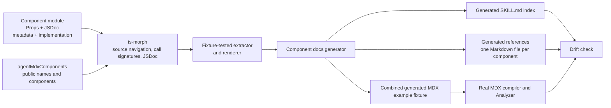

# Agent MDX Component Documentation Plan

## Status

The shared metadata contract exists at `src/lib/agent-mdx-component-docs.ts`. The source-extraction and reference-rendering framework is implemented and fixture-tested at `scripts/component-docs/extract.mjs` and `scripts/component-docs/render.mjs`. `npm run test:component-docs` tests its source contract with Metric and Badge fixtures. It uses ts-morph only to read source. It does not execute component modules.

Production component metadata, generated skill references, example validation, and drift checks are still planned. No production component has moved to this convention yet. The next work is to add the required props documentation and metadata to the existing catalog components.

## Objective

Generate complete, agent-facing component documentation from the same TypeScript modules that implement the components. Component prop types remain the only prop contract. Component descriptions, public defaults, semantic guidance, and examples live beside the implementation. Generated Markdown is a derived artifact and must never become a second handwritten source of truth.

The finished system should make these outcomes automatic:

- Every capitalized component in `agentMdxComponents` appears in the compact component index in `skills/agent-mdx/SKILL.md`.
- Every catalog component has one generated reference at `skills/agent-mdx/references/<ComponentName>.md`, using the exact agent-facing catalog key.
- Each reference shows the real authoring-facing TypeScript props, JSDoc prop descriptions, public defaults, guidance, and validated MDX examples.
- Generation fails when a catalog component is undocumented, metadata is invalid, an example does not compile, or committed generated files have drifted.
- Removing or renaming a catalog component removes or renames its generated documentation.

## System Map



## Source-of-Truth Boundaries

The source system has four distinct responsibilities:

1. `agentMdxComponents` defines which capitalized names an agent may use and supplies the component implementation for each name.
2. The component's exported TypeScript prop declaration defines its public authoring API.
3. JSDoc on the prop declaration explains individual props.
4. A typed metadata constant beside the component supplies the component description, layout, defaults, guidance, and examples.

The generated Markdown has no handwritten component facts. The handwritten parts of `SKILL.md` continue to own global MDX syntax, workflow, safety rules, validation, publication, and Telegram handoff.

The catalog key supplies the public component name. Component metadata does not repeat the name.

## Required Convention for Every Agent-Facing Component

Each catalog component must provide all of the following in its implementation module.

### 1. An exported authoring-facing prop type

The component must use one exported type alias or interface as its direct prop annotation. This declaration is the only prop contract.

```tsx
export type MetricProps = {
  /** Short label that identifies the value. */
  label: string;

  /** Main value, already formatted for display. */
  value: string;

  /** Change relative to the comparison period. */
  change?: string;

  /** Semantic direction used to style the change indicator. */
  changeType?: "positive" | "negative" | "neutral";

  /** Text shown immediately before the value. */
  prefix?: string;

  /** Text shown immediately after the value. */
  suffix?: string;
};
```

The declaration may reuse React or library types without expanding them. For example, `BadgeProps` can extend `React.ComponentPropsWithoutRef<"span">` and add its declared public props. Generated documentation should preserve that concise declaration instead of listing every DOM event and accessibility property.

Nested project types must also be exported when they are part of the authoring contract. For example, a `CalendarCardProps` declaration may refer to an exported `CalendarEventProps` declaration. The generator should include both declarations in the reference.

Project-local `typeof` queries are not supported in an authoring props declaration. They depend on a value declaration that is absent from the generated TypeScript block. Replace one with an exported type alias or interface that stands alone in the reference.

### 2. JSDoc on public props

Every prop declared by the Agent MDX authoring contract must have concise JSDoc. This requirement includes fields inside nested project-local object types. Props inherited from React or an external library are exempt because their declarations remain owned by that dependency. The generator validates JSDoc directly from the matching `PropertySignature` source nodes through ts-morph.

Ordinary JSDoc prose is preferred:

```tsx
/** Change relative to the comparison period. */
change?: string;
```

JSDoc tags should be rare. A short prop-level `@example` can clarify a format such as an ISO timestamp, while complete component examples belong in the component metadata.

### 3. A typed metadata constant

Each component module exports a metadata constant named `<camelCaseComponentName>MdxDocs`. Examples include `metricMdxDocs`, `badgeMdxDocs`, and `barGraphCardMdxDocs`.

```tsx
export const metricMdxDocs = {
  description:
    "Displays one important value with a label and optional change context.",
  flow: "block",
  defaults: {
    changeType: "neutral",
  },
  guidance: [
    "Format the value for display before passing it to the component.",
    "Use changeType only when the direction has a clear meaning.",
  ],
  examples: [
    {
      title: "Basic metric",
      mdx: `<Metric label="Revenue" value="$42,000" />`,
    },
    {
      title: "Metric with change",
      mdx: `<Metric
  label="Monthly active users"
  value="18,420"
  change="+12%"
  changeType="positive"
/>`,
    },
  ],
} as const satisfies AgentMdxComponentDocs<MetricProps>;
```

The metadata fields have these meanings:

- `description`: One concise statement of the component's purpose.
- `flow`: `inline` or `block`, describing how the component participates in document layout.
- `defaults`: Public defaults for optional authoring props. Use `{}` when there are no public defaults.
- `guidance`: Optional semantic rules that types cannot express. Keep this list short.
- `examples`: One or two complete MDX examples. One example is required. A second example should demonstrate an important optional state. More than two examples is a generation error.

Metadata values must be static literals that the generator can read without executing application code. Defaults must use the same literal value types that agents may write in MDX: strings, numbers, booleans, `null`, arrays, and objects.

### 4. An implementation that uses the documented defaults

The component should read its public defaults from the metadata constant where practical:

```tsx
export function Metric({
  changeType = metricMdxDocs.defaults.changeType,
  ...props
}: MetricProps) {
  // Implementation
}
```

This keeps the implementation and generated documentation on one value. A defensive fallback such as `props.data ?? []` does not create a public default and does not make a required prop optional.

For wrappers around library components, the local wrapper should set any documented public default explicitly at the Agent MDX boundary. The generator should not infer a public default from library internals.

### 5. Catalog registration

The component remains registered in `agentMdxComponents` under its public MDX name:

```tsx
export const agentMdxComponents = {
  Metric,
  // ...
} satisfies MDXComponents;
```

The generator derives `Metric` from this key, follows the imported component symbol to its source module, resolves `MetricProps`, and finds `metricMdxDocs` by convention. A missing or ambiguous props declaration or metadata export is a generation error.

## Shared Documentation Types

The shared metadata contract is `src/lib/agent-mdx-component-docs.ts`.

```ts
type OptionalKeys<Value> = {
  [Key in keyof Value]-?: object extends Pick<Value, Key> ? Key : never;
}[keyof Value];

export type AgentMdxDefaults<Props> = Partial<
  Pick<Props, OptionalKeys<Props>>
>;

export type AgentMdxExample = {
  title: string;
  mdx: string;
};

export type AgentMdxComponentDocs<Props> = {
  description: string;
  flow: "inline" | "block";
  defaults: AgentMdxDefaults<Props>;
  guidance?: readonly string[];
  examples: readonly [AgentMdxExample] | readonly [AgentMdxExample, AgentMdxExample];
};
```

The optional-key restriction prevents documentation from assigning a default to a required prop. TypeScript checks default names and values against the real prop type. The generator also enforces the static-literal rule and the maximum of two examples.

## Extraction Process

The implemented framework uses ts-morph to inspect source without importing or executing React modules. It accepts explicit `tsConfigFilePath`, `projectSourceRoot`, `catalogPath`, and optional `catalogName` inputs. The application TypeScript diagnostics remain authoritative for the `satisfies AgentMdxComponentDocs<Props>` contract, including default property names and value compatibility. This extraction layer does not repeat or simulate those diagnostics.

### Step 1: Load the project

- Create a ts-morph `Project` from the supplied `tsConfigFilePath`.
- Limit project-local declaration traversal to the supplied `projectSourceRoot`.
- Resolve imports and path aliases through that project.
- Do not import component modules or evaluate metadata.

### Step 2: Discover the public catalog

- Open `src/components/mdx/mdx-components.tsx`.
- Locate the exported `agentMdxComponents` object.
- Read each explicit property key as the public component name.
- Resolve each catalog entry as a callable component through its ts-morph call signature.
- Ignore lowercase `elementOverrides` and the combined renderer map.

The generator should require explicit catalog properties. Computed keys and spreads inside `agentMdxComponents` should fail because they make documentation discovery less predictable.

### Step 3: Resolve the authoring-facing prop declaration

For each component:

- Inspect the component's call signature and its first parameter.
- Require that parameter to be a direct reference to an exported project-local alias or interface. Inline parameter types are a source-convention error.
- Preserve the root declaration's raw `getText()` source.
- Follow `TypeReference` nodes to referenced exported project-local aliases and interfaces, and preserve each raw declaration after the root declaration.
- Require JSDoc on every `PropertySignature` in the root declaration and each referenced project-local declaration.
- Exempt React and external-library declarations from both traversal and JSDoc requirements.
- Preserve concise external references such as `React.ComponentPropsWithoutRef<"span">` instead of expanding their structural properties.

The generated TypeScript block should be authoring-facing source, not the fully expanded structural React type. The extractor does not create parallel property records for names, requiredness, types, or descriptions.

### Step 4: Extract component metadata

- Convert the component name to its expected metadata export name, such as `Metric` to `metricMdxDocs`.
- Find that export in the same component module.
- Require `as const satisfies AgentMdxComponentDocs<Props>` or an equivalent statically checkable form.
- Read `description`, `flow`, `defaults`, `guidance`, and `examples` from literal syntax.
- Preserve the defaults object initializer as exact raw source in `defaultsInitializer`.
- Reject computed keys, shorthand properties, spreads, function calls, property access, environment reads, and other executable expressions.
- Confirm that there is at least one example and that titles are unique within the component.
- Reject more than two examples.

Application TypeScript diagnostics perform the defaults check through `satisfies AgentMdxComponentDocs<Props>`. The generator adds clear domain errors for unsupported literal shapes and missing required metadata.

### Step 5: Build an internal normalized model

The framework creates one in-memory record per component:

```ts
type ExtractedComponent = {
  name: string;
  propsTypeName: string;
  typeDeclarations: string[];
  description: string;
  flow: "inline" | "block";
  defaultsInitializer: string;
  guidance: string[];
  examples: Array<{
    title: string;
    mdx: string;
  }>;
};
```

`propsTypeName` is the direct exported root props declaration name. The renderer uses it to write `AgentMdxDefaults<PropsType>` without parsing declaration source text. This model is an implementation detail. It has no slug because generated reference filenames use the exact catalog name. The TypeScript catalog remains the machine-readable source of truth, so the first version does not need to commit a second JSON catalog unless another tool has a concrete need for one.

### Step 6: Validate every MDX example

- Combine all extracted examples into one temporary project-local MDX fixture with valid front matter and headings that identify the source component and example.
- Compile the fixture with the real `mdxCompileOptions`.
- Start one MDX Analyzer process for the complete check.
- Analyze the combined fixture against the real `MDXProvidedComponents` type.
- Map each diagnostic back to its component and example.
- Remove the temporary fixture after the check.

One combined fixture avoids a separate language-server cold start for every example. A syntax error, unavailable component, missing required prop, or incompatible prop value fails generation.

The initial implementation should validate static authoring correctness. Browser rendering and screenshot review remain separate application-quality checks.

## Generated Outputs

### Compact component index in `SKILL.md`

The generator replaces only a bounded section:

```md
<!-- BEGIN GENERATED COMPONENT INDEX -->
## Components

- [Badge](references/Badge.md): Short inline status, category, or label.
- [Metric](references/Metric.md): Block display for one important value and its context.
<!-- END GENERATED COMPONENT INDEX -->
```

The index contains only the public name, flow, short description, and reference link. This section loads for every Agent MDX task, so it must stay compact.

The generator preserves all handwritten content outside the markers. Missing, duplicated, or reversed markers are errors.

### One reference per component

Generate `skills/agent-mdx/references/<ComponentName>.md`, such as `Metric.md` and `BarGraphCard.md`. The filename must exactly match the public key in `agentMdxComponents`, including case. This direct mapping lets an agent infer the reference path without applying a filename transformation.

Each reference follows one stable template:

````md
# Metric

Displays one important value with a label and optional change context.

**Layout:** Block

## Props

```ts
export type MetricProps = {
  /** Short label that identifies the value. */
  label: string;
  // ...
};
```

## Defaults

```ts
export const metricDefaults = {
  changeType: "neutral",
} satisfies AgentMdxDefaults<MetricProps>;
```

## Guidance

- Format the value for display before passing it to the component.
- Use `changeType` only when the direction has a clear meaning.

## Examples

### Basic metric

```mdx
<Metric label="Revenue" value="$42,000" />
```
````

The reference should omit the Guidance section when the component has no guidance. It should always show Defaults, using an empty typed object when the component has no public defaults.

Prop JSDoc appears only inside the generated TypeScript declaration. The generator must not repeat the same prop descriptions in a table or separate prose section.

### Generated example fixture

The combined example fixture may remain temporary. If debugging generated examples becomes difficult, the generator can optionally retain a deterministic fixture under `tests/generated/`. This should be added only when a concrete debugging need appears.

## Future Generator Commands

Add these repository commands with the generator work. The implemented framework currently provides `npm run test:component-docs` only.

```json
{
  "scripts": {
    "generate:component-docs": "node scripts/generate-component-docs.mjs",
    "check:component-docs": "node scripts/generate-component-docs.mjs --check"
  }
}
```

`generate:component-docs` writes the bounded skill index and all component reference files. It removes orphaned generated references for components that are no longer in the catalog.

`check:component-docs` computes expected output without changing tracked files, compares it with the repository, validates all examples, and exits nonzero on drift or invalid source metadata.

The generator should print short file-specific errors that identify the component and missing or invalid field.

## Validation and Drift Contract

The completed check fails for any of these conditions:

- A catalog component has no exported direct authoring-facing props declaration.
- A declared authoring prop or project-local nested field has no JSDoc description.
- A catalog component has no matching metadata export.
- Metadata contains a computed or executable value.
- `flow` is absent or invalid.
- The application TypeScript diagnostics reject the `satisfies AgentMdxComponentDocs<Props>` declaration, including a required prop in `defaults` or an incompatible default value.
- A component has no example.
- A component has more than two examples.
- An example fails MDX compilation or Analyzer type checking.
- A generated reference is missing, stale, or orphaned.
- The generated `SKILL.md` section differs from the source metadata.
- Handwritten `SKILL.md` content outside the generated markers changes during generation.

Run these checks after implementation:

```text
npm run generate:component-docs
npm run check:component-docs
npm run test:mdx-validation
npm run lint
npm run build
```

## Initial Component Migration

Normalize every current entry in `agentMdxComponents`:

- `Badge`
- `BarGraphCard`
- `CalendarCard`
- `Card`
- `ChatCard`
- `Collapsible`
- `CollapsibleContent`
- `CollapsibleTrigger`
- `Icon`
- `LineGraphCard`
- `Metric`
- `Progress`
- `Stack`
- `StockQuoteCard`
- `TodoListCard`
- `TweetCard`

The migration work for each component is:

1. Export a concise authoring-facing props alias or interface.
2. Add JSDoc for every declared authoring prop and nested project-local field.
3. Add the typed `<component>MdxDocs` metadata constant.
4. Make documented defaults explicit and reuse them in the implementation where practical.
5. Add one basic example and one important optional-state example when useful.
6. Confirm that the example uses literal MDX values allowed by the skill.

Components that share a prop type, such as `BarGraphCard` and `LineGraphCard`, may share the same exported props declaration. Each component still needs its own metadata because its description, flow, guidance, and examples can differ.

Files that export several catalog components, such as `collapsible.tsx`, should contain one metadata constant per public catalog component.

## Rollout Sequence

### Phase 1: Complete the source framework

- Completed: ts-morph catalog discovery, exported named props resolution, referenced local type traversal, JSDoc checks, static metadata extraction, and deterministic Markdown rendering.
- Completed: fixture tests for Metric and Badge, plus focused contract failures.
- Deliberate boundary: application TypeScript diagnostics own the `satisfies` contract. The source framework reads its syntax and does not duplicate TypeScript assignability checks.

### Phase 2: Migrate the production component catalog

- Add exported authoring-facing props, JSDoc, and typed metadata to every existing catalog component.
- Review the resulting authoring surface before generated references are published to the Agent MDX skill.

### Phase 3: Add generation, example validation, and drift checking

- Generate the bounded Agent MDX skill index and one reference per migrated component.
- Build the combined temporary MDX example fixture.
- Compile it with the real renderer options.
- Analyze it with one MDX Analyzer process.
- Add `--check` mode and focused generator tests.

### Phase 4: Add the repository gate

- Run `check:component-docs` in the normal validation workflow.
- Document the generator command in `AGENTS.md`.
- Update the operationalization documents to describe the implemented convention and remove obsolete open questions.
- Verify that OpenClaw loads the updated skill and can progressively read a generated component reference.
- Remove the temporary kitchen-sink fallback guidance from `SKILL.md` after all catalog references exist.
- Keep `examples/kitchen-sink.mdx` as an application demo and visual regression surface rather than an authoring contract.

## Focused Test Plan

Add generator tests for:

- Catalog name discovery and lowercase override exclusion.
- Component-to-metadata naming conversion.
- Direct named props declaration enforcement.
- Raw root and referenced local type declaration extraction.
- JSDoc validation from `PropertySignature` source nodes.
- Missing JSDoc rejection for declared authoring props and nested project-local fields.
- Inherited React and external-library prop exemption.
- Concise inherited React prop declarations without structural expansion.
- Referenced project-local nested type inclusion.
- Optional-key defaults acceptance and required-key defaults rejection.
- Static-literal metadata rejection for calls, computed keys, shorthand properties, and spreads.
- Exact raw defaults initializer extraction and normalized code-fence rendering.
- Stable Markdown output and stable component ordering.
- Bounded `SKILL.md` replacement that preserves handwritten text byte for byte.
- Orphaned reference detection.
- Combined MDX example compilation and Analyzer diagnostics.
- `--check` success on clean output and failure on drift.

## Resolved Decisions

- TypeScript prop declarations are the only prop schema.
- Every declared authoring prop and nested project-local field requires standard JSDoc. Inherited React and external-library props are exempt.
- Generated prop descriptions appear inside the TypeScript declaration only.
- Component-level prose and examples use a typed static metadata constant beside the component.
- Public component names come from `agentMdxComponents` and are not repeated in metadata.
- Metadata association uses the predictable `<camelCaseComponentName>MdxDocs` export convention.
- Every component has one or two examples. The generator rejects zero examples and more than two examples.
- Component guidance remains optional so components without meaningful semantic constraints do not acquire filler text.
- Reference filenames exactly match the agent-facing component names, including case, such as `Badge.md` and `BarGraphCard.md`.
- Generated documentation is committed because OpenClaw reads it directly from the repository skill package.
- The generator uses ts-morph source navigation and does not execute component modules.
- The normalized record stores raw `typeDeclarations` and `defaultsInitializer`; it does not store a slug or parallel per-property records.
- Application TypeScript diagnostics remain authoritative for the `satisfies AgentMdxComponentDocs<Props>` type contract.
- One Analyzer process validates one combined fixture for all component examples.
- The TypeScript catalog remains the machine-readable catalog. A second committed JSON catalog requires a real consumer.
