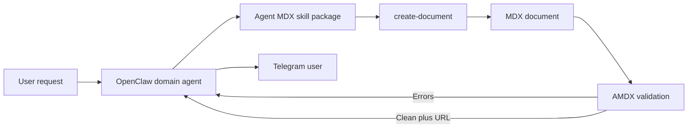

# Direct OpenClaw Authoring Approach

## Status

This document describes the selected architecture for AMDX authoring, validation, readiness, and user handoff.

The shared AMDX component contract, front matter, file layout, route shape, and validation requirements remain defined in [AMDX Operationalization](OPERATIONALIZATION.md).

## Summary

This approach assigns AMDX authoring to the OpenClaw agent that is responding to the user. One OpenClaw skill package guides the agent through selection, document creation, authoring, validation, repair, and Telegram handoff.

The agent retains its complete domain and conversation context while it creates the document. The skill package and deterministic tooling supply the current syntax and component contract and enforce document creation and readiness requirements.

## Decision Boundary

This approach uses the complete shared contract in [AMDX Operationalization](OPERATIONALIZATION.md). It does not define a different file format, metadata model, filename, route, component API, validation standard, or user-facing result.

Its distinguishing choices are:

- the OpenClaw domain agent authors the MDX document;
- the OpenClaw domain agent runs validation and repairs the document;
- the OpenClaw domain agent completes the validation and readiness gate and receives the derived URL directly.

## Workflow

1. The OpenClaw agent decides that the response benefits from AMDX.
2. The agent reads `SKILL.md`, which contains the workflow, global Markdown and MDX syntax, and a compact generated component index.
3. The agent selects components and reads each generated reference file when it is present, or that component's validated kitchen-sink example when the reference is unavailable.
4. The agent calls `{skillDir}/scripts/create-document.mjs "<title>"` from its OpenClaw workspace and receives the absolute document path.
5. The agent writes the complete document at that path under `documents/`.
6. The agent runs the initial AMDX validation command.
7. The agent makes at most two repair-and-validation rounds, stopping earlier when the complete diagnostic set is unchanged or a directly addressed diagnostic remains at the same source location.
8. The successful final validation derives and returns the user-facing URL.
9. The agent sends the URL and a short message to the user through Telegram.



## Responsibilities

### OpenClaw agent

The calling OpenClaw agent is responsible for:

- deciding whether AMDX is appropriate;
- gathering and checking the domain facts;
- choosing the Markdown structure, layout, and agent-facing components;
- reading `SKILL.md` and the references for selected components;
- choosing the document title;
- invoking `create-document` and editing the returned document path;
- running the initial validation and bounded repair loop;
- relaying the successful URL to the user;
- handling validation failures and later user questions.

### OpenClaw Agent MDX skill

One skill package should define the complete direct-authoring workflow:

- when to use AMDX;
- the global Markdown and MDX syntax accepted by AMDX;
- how to select components from the compact index;
- how to read each generated reference that is present for a selected component;
- how to invoke `create-document` from the current OpenClaw workspace;
- how to compose an MDX document at the returned path;
- how to run validation and interpret diagnostics;
- how to repair common authoring errors;
- how to send the Telegram message.

`SKILL.md` should contain the handwritten workflow and global syntax guidance. It should also contain a bounded generated component index with each component's name, purpose, inline or block layout, and direct link to its reference file. The index should remain concise enough to load for every AMDX task. When a selected component reference is absent, the agent should use Markdown instead of guessing props.

Detailed component contracts should live in generated `references/<component>.md` files and load only when the agent selects those components. The skill package should avoid handwritten copies of component contracts.

Until a selected component has a generated reference, the agent may read only that component's validated example in `examples/kitchen-sink.mdx`. It should use Markdown when neither source documents the needed use and must not guess component props.

The canonical package lives at `skills/agent-mdx` in the AMDX repository. The global OpenClaw configuration adds the repository's `skills` directory to `skills.load.extraDirs`, which makes the same package available to every agent directly from its canonical location. OpenClaw gives extra skill directories its lowest skill precedence, so the `agent-mdx` name must remain unique across higher-precedence skill sources.

### `create-document` command

The skill should invoke the command with the title as its first positional argument:

```text
{skillDir}/scripts/create-document.mjs "Morning briefing"
```

Using `{skillDir}` resolves the loaded skill script without changing the caller's current working directory. The command should:

- read and resolve the caller's current working directory;
- accept `~/.openclaw/workspace` as agent `main`;
- accept `~/.openclaw/workspace-<agent>` as the named agent;
- accept descendant directories inside those workspace roots;
- reject every other working directory with a clear diagnostic and nonzero exit status;
- derive the local date and URL-safe slug from the title;
- create `documents/<yyyy-mm-dd>/<agent>/<slug>.mdx` with required front matter;
- use exclusive file creation and append `-2`, `-3`, and later numeric suffixes when needed;
- print the absolute document path on standard output.

The agent identity is derived from the workspace path. It is not accepted as an argument.

### Validation and readiness command

The validation command accepts the absolute path returned by `create-document`. It is responsible for:

- resolving the input and confirming that it is a lowercase `.mdx` file contained under the AMDX `documents/` root;
- compiling it with AMDX's real compiler options;
- parsing the required front matter from the current file bytes;
- using MDX Analyzer to reject unavailable agent-facing components and check required props and incompatible prop values;
- returning clear diagnostics with source locations;
- using a machine-readable exit status that the agent can act on;
- deriving the route and user-facing URL from the validated path after all static checks pass.

On success, the command prints a JSON object with only `ok`, `path`, and `url`.

The validator should not repeat the creator's workspace-to-agent mapping, date and slug derivation, collision handling, or metadata-to-path consistency checks. `create-document` owns those invariants. Containment and the lowercase extension remain validator input-boundary checks because the validation command accepts a filesystem path. Front matter parsing remains a content check because the agent can replace the file bytes while editing.

In this Direct OpenClaw approach, the agent calls only the validation command. The command owns the MDX language-server integration and diagnostic formatting. A future Pi authoring agent can use `pi-lsp` directly during its authoring loop and still calls this shared validator for the final readiness result.

## Skill Package Authoring Reference

The OpenClaw agent needs concise global guidance in `SKILL.md`. The always-loaded syntax section should include:

- CommonMark and supported GitHub Flavored Markdown features;
- `==highlight==` markers;
- GitHub-style alerts;
- fenced code blocks and syntax highlighting;
- Markdown blocks inside JSX component children;
- literal component prop expressions only, with no imports, exports, scripts, or executable expressions.

`SKILL.md` should then present the compact generated component index. After the agent selects components, it should load one generated Markdown reference per selected component. Each component reference should include its purpose, layout, authoring-facing TypeScript declaration, typed public defaults, semantic guidance, and a validated MDX example.

The component index and per-component references should be generated from `agentMdxComponents`, the React prop types, nearby JSDoc, public defaults, and validated examples. The generator should update only its bounded section inside `SKILL.md`. A check should fail when generated content differs from its sources. Syntax examples in `SKILL.md` should compile through AMDX's real renderer pipeline.

## Authoring and Repair Loop

The skill should direct the agent to create the document under the repo-local, gitignored `documents/` root and edit that same file through the complete repair loop. The file stays at one path throughout creation, validation, and use.

The loop is bounded:

1. write the initial document and run validation;
2. inspect every diagnostic on failure;
3. make one repair and run validation again;
4. make one final repair and run validation again only when the previous diagnostics changed;
5. stop early when a diagnostic repeats;
6. receive the derived URL only from a successful final validation.

Every edit requires another validation. When the loop stops without a successful result, the agent should return a concise Telegram response or explain that it could not prepare the richer document. A failed AMDX attempt should not prevent the user from receiving the underlying answer.

## Validator Proof of Concept

The proof of concept exposes reusable `validateAmdx(path)` logic through `npm run validate:mdx -- <absolute-document-path>`. The replacement test suite calls the same implementation used by the agent-facing command.

The validation command retains these distinct checks:

- compilation with AMDX's exact MDX plugin pipeline;
- strict MDX Analyzer diagnostics for component availability and React prop types.

The removed remark catalog check is not part of the proof of concept. MDX Analyzer covers unavailable components and returns source ranges, so the extra traversal and component-map extraction would duplicate the authoritative type check.

The completed proof-of-concept benchmark compared separate-process cold validation with repeated validations through one persistent Analyzer. The findings are recorded in [AMDX Operationalization](OPERATIONALIZATION.md#performance-findings). The benchmark utility is not part of the planned workflow.

The selected initial workflow starts and stops MDX Analyzer during every validation command, including every repair pass. This keeps the validator stateless between agent tool calls. [GitHub issue #5](https://github.com/NickChristensen/amdx/issues/5) tracks a possible temporary Analyzer session that would remain alive only after a failed validation and shut down after a clean result, cancellation, or idle timeout.

Publication begins when the validator returns its successful structured result. It derives the route internally and returns the path and URL through the shared AMDX path functions without requesting the document route. The shared publication contract tests in [AMDX Operationalization](OPERATIONALIZATION.md#publication-contract-tests) cover route and URL behavior. A known-document application smoke test covers the running renderer separately.

## Tool and Filesystem Boundaries

The OpenClaw agent needs permission to:

- read `SKILL.md` and generated references for selected components;
- read relevant input data and attachments from its own workspace;
- invoke `create-document` from its OpenClaw workspace;
- write the exact MDX file returned by `create-document`;
- invoke the validation command.

The agent needs write access only to the document path returned by `create-document`. The command enforces workspace identity, path shape, and exclusive creation. The repo-local `documents/` root keeps the document, MDX Analyzer, validator, and renderer in the same TypeScript-project context.

## Benefits to Evaluate

- The authoring agent retains the full user conversation and domain context.
- The workflow uses one model invocation for the user request and document composition.
- OpenClaw can repair the document within the same reasoning loop that gathered the facts.
- The handoff between agents is eliminated.
- Deterministic code still controls initialization, trusted metadata, paths, validation, and URL derivation.
- The workflow can fall back to a Telegram response within the same agent session.

## Costs and Risks to Evaluate

- Every OpenClaw agent must learn and follow the AMDX authoring workflow.
- `SKILL.md` must provide enough global guidance for agents with different capabilities and context budgets.
- Authoring knowledge can consume context that the agent also needs for its domain task.
- Renderer syntax changes can require updates to the handwritten syntax section.
- Component changes require regenerated index and reference files.
- Agents may vary in their use of diagnostics and repair behavior.
- Broad workspace tools may allow writes outside the path returned by `create-document`.

## Proposed Evaluation

Build one end-to-end vertical slice and test it through representative OpenClaw agents and documents:

- a prose-heavy briefing;
- a briefing with structured data and visual components;
- a document that requires component prop repair;
- a request with incomplete source data;
- a validation failure;
- a case where AMDX fails and the agent must fall back to Telegram.

Record:

- first-pass and final validation success;
- number of repair iterations;
- total authoring and validation time;
- factual fidelity to the agent's source context;
- component and layout quality;
- validation success;
- model and token cost;
- consistency across different OpenClaw agents;
- quality of the final Telegram handoff and failure fallback.

## Open Questions

- What exact read, write, and command permissions should the skill receive?
- How should the approach be tested across agents with different prompts, tools, and models?
