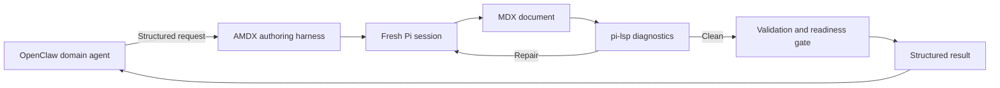

# Dedicated Pi Authoring Agent Approach

## Status

This document describes an unselected alternative for AMDX authorship, validation, readiness, and user handoff. It remains available for a possible future experiment.

[AMDX Operationalization](OPERATIONALIZATION.md) defines the shared document contract and readiness invariants. This document relies on that contract and records only the responsibilities, handoffs, tools, and evaluation questions unique to the dedicated Pi approach.

## Summary

This approach assigns MDX composition to a dedicated agent built with [Pi](https://pi.dev/) and [pi-lsp](https://github.com/narumiruna/pi-extensions/tree/main/packages/pi-lsp). The OpenClaw domain agent supplies the facts and presentation intent, then receives a structured readiness result for its Telegram response.

The approach changes three ownership decisions:

- the Pi agent authors the document from an OpenClaw briefing;
- the Pi agent requests diagnostics and repairs its document;
- the Pi agent invokes the shared validation and readiness gate through the authoring harness.

All document structure, validation standards, destination rules, rendering behavior, and user-facing URL requirements come from the shared operationalization record.

## Workflow

1. The OpenClaw domain agent decides that the response benefits from AMDX.
2. It prepares a structured request containing the facts, intent, data, sources, attachments, and constraints.
3. The OpenClaw skill invokes the AMDX authoring harness.
4. The harness validates the request and creates a repo-local document with the shared `create-document` logic.
5. The harness starts a fresh Pi session with the dedicated system prompt, assigned document path, and restricted tools.
6. The Pi agent writes the document, calls pi-lsp diagnostics, and repairs the file until the required checks are clean or it needs more input.
7. The Pi agent calls the shared validation and readiness gate.
8. The harness returns the tool's structured result to the OpenClaw agent.
9. The OpenClaw agent handles success, missing input, or failure in the user conversation.



## Responsibility Split

### OpenClaw domain agent

The OpenClaw agent is responsible for:

- deciding whether to use AMDX;
- gathering and checking the domain facts;
- supplying a self-contained briefing and structured data;
- identifying sources and freshness for time-sensitive facts;
- answering a `needs_input` result;
- communicating the readiness result or failure to the user;
- handling later user questions.

### Pi authoring agent

The Pi agent is responsible for:

- choosing the presentation structure and components within the shared authoring contract;
- following the authoring workflow and global Markdown and MDX syntax in the dedicated system prompt;
- using the compact component index supplied to the Pi session;
- reading the generated reference for every selected component;
- using only the supplied facts and sources;
- writing the assigned document;
- requesting diagnostics and repairing its work;
- invoking the validation and readiness gate after diagnostics are clean;
- reporting missing information when safe composition requires more context.

### Relationship to the AMDX authoring contract

The Pi authoring agent uses a dedicated system prompt. It does not invoke or load the OpenClaw Agent MDX skill. The OpenClaw skill is responsible only for selection, request preparation, harness invocation, result relay, and user-facing failure handling in this approach.

The dedicated Pi system prompt owns the authoring workflow, global syntax guidance, fresh-session lifecycle, request boundary, diagnostic calls, readiness-gate call, and structured result behavior. The harness should supply a compact component index and make the generated `references/<component>.md` files available on demand.

The Pi experiment should use the same runtime syntax and component contract as Direct OpenClaw authoring. Component details should come from the shared generated per-component references and machine-readable catalog. Renderer syntax examples should use the shared contract tests. A future experiment must decide how to compose the Pi system prompt from the shared authoring contract without making the Pi agent depend on the OpenClaw skill.

### Authoring harness

The deterministic harness is responsible for:

- validating the request envelope;
- deriving trusted caller metadata required by the shared contract;
- invoking the shared `create-document` logic with the trusted OpenClaw caller workspace and requested title;
- assigning the returned document path to the Pi session;
- starting a fresh Pi session;
- loading the dedicated system prompt and Pi extensions;
- exposing only the approved read, document-write, diagnostic, and readiness tools;
- enforcing session timeout and cancellation behavior;
- returning the structured readiness result instead of parsing the Pi agent's final prose.

### Validation and readiness integration

The shared validation command is the Pi agent's only readiness mechanism. Its validation, containment, route derivation, and URL behavior belong to the shared operational contract. The Pi agent can use `pi-lsp` directly during authoring, then calls the shared validator for its final readiness result.

The Pi-specific harness must:

- pass the assigned document path and trusted caller metadata to the gate;
- restrict Pi writes to the assigned document path;
- retain the gate's structured success or failure result;
- expose that exact result to OpenClaw.

## Request Contract

The request must carry enough context for a second agent to compose the document without reconstructing facts from the original conversation.

```ts
type AmdxRequest = {
  requestId: string;
  intent: string;
  title: string;
  brief: string;
  data?: unknown;
  sources?: Array<{
    label: string;
    url?: string;
    note?: string;
  }>;
  attachments?: string[];
  constraints?: string[];
};
```

The harness adds trusted caller metadata. Large data inputs may use read-only attachment paths when embedding them in the request would be unwieldy.

## Result Contract

The harness returns a discriminated result created from deterministic harness and readiness state:

```ts
type AmdxResult =
  | {
      status: "ready";
      title: string;
      path: string;
      url: string;
      telegramSummary?: string;
      warnings: string[];
    }
  | {
      status: "needs_input";
      questions: string[];
    }
  | {
      status: "failed";
      stage: "authoring" | "validation";
      message: string;
    };
```

The Pi agent's final prose remains informational. The OpenClaw integration consumes the structured result.

## Pi Session Lifecycle

Each request uses a fresh Pi session with no retained conversation history. This prevents content from one OpenClaw workspace from entering another request and makes the loaded context reproducible.

The session runs from the AMDX repository so it can read the dedicated system prompt, generated per-component references, supplied attachments, and validation configuration. A Node-based harness can use Pi's SDK with an in-memory session. Process-isolated RPC remains an option if its isolation benefits justify the added process boundary.

The dedicated system prompt should require the agent to:

1. treat the request as the source of domain facts;
2. ask for missing information instead of inventing it;
3. write only to its assigned document path;
4. call `lsp_diagnostics` after authoring and relevant repairs;
5. call the validation and readiness gate only after diagnostics are clean;
6. finish only after readiness succeeds, more input is required, or a structured failure blocks progress.

## pi-lsp Behavior

pi-lsp gives the Pi agent explicit `lsp_diagnostics` and `lsp_fix` tools. The AMDX configuration routes assigned `.mdx` files to `@mdx-js/language-server` within the AMDX TypeScript project.

Diagnostics are requested through a tool call. pi-lsp starts and stops the language server for each call, so the system prompt must require diagnostics at the relevant points in the repair loop. The shared validation and readiness gate remains authoritative.

The Pi spike should measure language-server startup time and the number of diagnostic calls per document. A persistent server or custom LSP integration should be considered only if measured latency warrants it.

## Restricted Tool Model

Pi extensions run with the host user's permissions. The harness must provide a narrower operational boundary.

The Pi agent needs tools to:

- read references for selected components and supplied attachments;
- write its assigned document;
- request MDX diagnostics;
- call the validation and readiness gate.

The Pi agent should not receive general write access to the AMDX application source or other documents. The harness should enforce the assigned-path restriction through custom tools or an operating-system sandbox.

## Benefits to Evaluate

- OpenClaw skills carry only selection, request, and relay guidance.
- The dedicated prompt can focus on visual communication and valid MDX.
- Global syntax and component guidance remain aligned with Direct OpenClaw authoring.
- A fresh session gives each document a predictable authoring context.
- Explicit LSP calls provide targeted feedback during composition.
- A smaller dedicated model may provide sufficient authoring quality.

## Costs and Risks to Evaluate

- Every AMDX response adds another model invocation.
- The request duplicates part of the OpenClaw agent's context.
- An incomplete briefing can cause a second agent to misinterpret the desired document.
- LSP startup and repair cycles add latency.
- Pi and its extensions require a carefully enforced permission boundary.
- Structured request and result contracts add implementation work.
- A failed or stalled second-agent run adds a new failure mode to the user response path.

## Proposed Evaluation

Build one end-to-end vertical slice with representative requests:

- a prose-heavy briefing;
- a briefing with structured data and visual components;
- a document that requires diagnostic repair;
- a request that should return `needs_input`;
- a Pi timeout or authoring failure;
- a shared validation or route failure.

Record the Pi-specific outcomes:

- factual fidelity to the request;
- request completeness and size;
- first-pass diagnostic status and repair count;
- Pi session and LSP latency;
- total model and token cost;
- component and layout quality;
- structured-result reliability;
- success of the OpenClaw relay and `needs_input` loop.

Shared validator coverage, path behavior, renderer behavior, URL derivation, and storage policy should be tested as shared AMDX capabilities rather than repeated as Pi evaluation criteria.

## Open Questions

- Which Pi model and thinking level provide the required authoring quality at acceptable cost?
- Should the harness use the Pi SDK or a process-isolated RPC session?
- What exact read, write, and command permissions should the Pi session receive?
- How should the harness compose the Pi system prompt from the shared syntax contract and generated component catalog without creating a second drifting source of truth?
- How should OpenClaw invoke the harness and pass attachment paths?
- How should the authoring agent request more information from OpenClaw?
- Should `telegramSummary` be authored by the Pi agent or composed entirely by OpenClaw?
- How should the harness time out or cancel a stalled Pi session?
- What Pi-specific evidence should the harness retain for diagnostics and retries?
